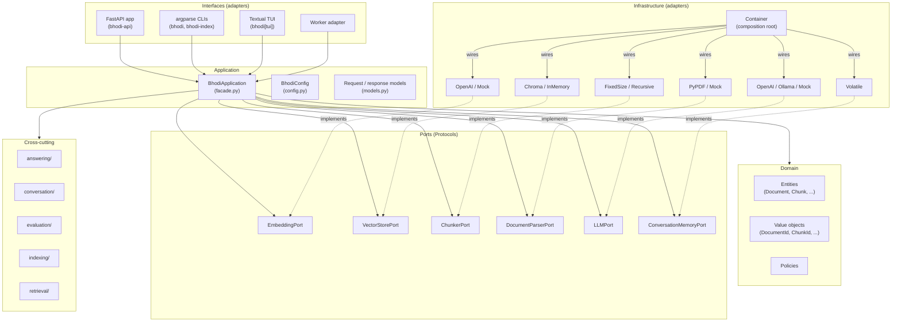

# Bhodi

[](https://github.com/4nibhal/Bhodi/actions/workflows/ci.yml)
[](https://www.python.org/)
[](LICENSE)

**A backend RAG engine for Python developers.**

Bhodi indexes documents and answers questions using retrieval-augmented generation. It is built as a modular, hexagonal backend that you can run as a library, a CLI, or a REST API — with swappable adapters for embeddings, vector stores, LLMs, chunkers, and parsers.

> **Status:** Beta. The core indexing/query pipeline is functional. **Authentication, persistent conversation memory, and a managed SaaS distribution are not implemented yet.** See [Roadmap](#roadmap).

---

## Try it in 30 seconds (no API keys)

```bash
uv tool install bhodi

export BHODI_EMBEDDING_PROVIDER=mock
export BHODI_LLM_PROVIDER=mock
export BHODI_VECTOR_STORE_PROVIDER=in_memory

bhodi index ./document.pdf
bhodi query "What is this document about?"
bhodi health
```

Uses mock adapters. No network calls. No OpenAI account required. Good for exploring the CLI and local testing.

> Or with **pipx**: `pipx install bhodi`

---

## Installation

```bash
uv tool install bhodi
```

Or with **pipx**:

```bash
pipx install bhodi
```

### Optional extras

| Extra | Install command | What it adds |
|-------|-----------------|--------------|
| `bhodi[local-llm]` | `uv tool install bhodi --with bhodi[local-llm]` | `llama-cpp-python==0.3.26`, `ollama==0.6.2` |
| `bhodi[tui]` | `uv tool install bhodi --with bhodi[tui]` | `textual==8.2.7` (Textual TUI) |
| `bhodi[telemetry]` | `uv tool install bhodi --with bhodi[telemetry]` | `opentelemetry-api/sdk/exporter-otlp==1.42.1` |
| `bhodi[all]` | `uv tool install bhodi --with bhodi[all]` | All of the above |

With pipx:

```bash
pipx install bhodi
pipx inject bhodi bhodi[local-llm]    # or bhodi[tui], bhodi[telemetry], bhodi[all]
```

> **Why uv/pipx instead of pip?** `uv tool install` and `pipx install` install Bhodi in an isolated environment, avoiding dependency conflicts with your system Python or other projects.

### Development install

```bash
git clone https://github.com/4nibhal/bhodi.git
cd bhodi
uv sync
uv run pytest
```

---

## Quick start

### CLI (3 entry points)

```bash
export OPENAI_API_KEY="sk-..."

# Index a document (uses mock providers if you set BHODI_*_PROVIDER=mock)
bhodi-index ./document.pdf --chunk-size 512 --overlap 64
bhodi-index ./document.pdf --metadata '{"author": "Test"}'

# Query
bhodi query "What is this document about?"

# Health check
bhodi health
```

You can also drive the top-level `bhodi` command (`bhodi index ...`, `bhodi query ...`, `bhodi health`), and the dedicated `bhodi-api` server:

```bash
bhodi-api --host 0.0.0.0 --port 8000
```

### Python API

```python
import asyncio
from bhodi_platform.application.config import BhodiConfig
from bhodi_platform.application.facade import BhodiApplication
from bhodi_platform.infrastructure.container import Container
from bhodi_platform.application.models import IndexDocumentRequest, QueryRequest


async def main() -> None:
    config = BhodiConfig(
        embedding={"provider": "openai", "model": "text-embedding-3-small"},
        vector_store={"provider": "chroma", "persist_directory": "./data/chroma"},
        chunker={"provider": "recursive", "chunk_size": 512, "overlap": 64},
        llm={"provider": "openai", "model": "gpt-4o-mini"},
        parser={"provider": "pypdf"},
        conversation={"provider": "volatile"},
    )

    app = Container(config).build()  # returns BhodiApplication

    indexed = await app.index_document(
        IndexDocumentRequest(source="./document.pdf", metadata={"author": "Test"})
    )
    print(f"Indexed {indexed.chunk_count} chunks from {indexed.document_id}")

    answer = await app.query(QueryRequest(question="What is this about?", top_k=5))
    print(answer.answer_text)
    for cite in answer.citations:
        print(f"  - {cite.source_document} p.{cite.page}: {cite.text[:80]}")


asyncio.run(main())
```

### REST API

```bash
export OPENAI_API_KEY="sk-..."
bhodi-api
```

In another terminal:

```bash
# Health
curl http://localhost:8000/health

# Index a document
curl -X POST http://localhost:8000/documents \
  -H "Content-Type: application/json" \
  -d '{"source": "./document.pdf"}'

# Query
curl -X POST http://localhost:8000/query \
  -H "Content-Type: application/json" \
  -d '{"question": "What is this about?"}'

# Delete a document
curl -X DELETE http://localhost:8000/documents/<document_id>

# Get conversation history
curl http://localhost:8000/conversations/<conversation_id>
```

The API enforces **100 requests / 60 seconds per IP** (HTTP 429 when exceeded). `/health` is excluded. There is **no authentication** — deploy behind a reverse proxy with auth, a VPN, or similar.

Interactive API docs are served at `/docs` (Swagger UI), `/redoc`, and `/openapi.json`.

---

## Architecture

Bhodi uses a hexagonal (ports and adapters) layout. Interfaces call into the `BhodiApplication` facade, which orchestrates ports; concrete adapters are wired in by the `Container`.



For the full directory tree and design decisions, see [docs/architecture/overview.md](docs/architecture/overview.md).

---

## Configuration

All runtime behavior is driven through `BhodiConfig` (Pydantic models in `bhodi_platform.application.config`):

```python
from bhodi_platform.application.config import (
    BhodiConfig,
    EmbeddingConfig,
    VectorStoreConfig,
    LLMConfig,
    ChunkerConfig,
    DocumentParserConfig,
    ConversationConfig,
)

config = BhodiConfig(
    embedding=EmbeddingConfig(
        provider="openai",
        model="text-embedding-3-small",
        batch_size=100,
    ),
    vector_store=VectorStoreConfig(
        provider="chroma",
        persist_directory="./data/chroma",
        collection_name="bhodi",
    ),
    chunker=ChunkerConfig(provider="recursive", chunk_size=512, overlap=64),
    llm=LLMConfig(provider="openai", model="gpt-4o-mini", temperature=0.7),
    parser=DocumentParserConfig(provider="pypdf"),
    conversation=ConversationConfig(provider="volatile", max_history=50),
)
```

### Environment variables

| Variable | Default | Purpose |
|----------|---------|---------|
| `BHODI_API_HOST` | `127.0.0.1` | API server bind host (overridden by `bhodi-api --host`) |
| `BHODI_API_PORT` | `8000` | API server bind port (overridden by `bhodi-api --port`) |
| `BHODI_API_SOURCE_ROOT` | unset | When set, constrains local file ingest for `POST /documents` |
| `OPENAI_API_KEY` | — | Required when any `openai` adapter is selected |
| `BHODI_PARSER_PROVIDER` | `pypdf` | Override parser provider |
| `BHODI_CHUNKER_PROVIDER` | `recursive` | Override chunker provider |
| `BHODI_EMBEDDING_PROVIDER` | `openai` | Override embedding provider |
| `BHODI_VECTOR_STORE_PROVIDER` | `chroma` | Override vector store provider |
| `BHODI_LLM_PROVIDER` | `openai` | Override LLM provider |
| `BHODI_CONVERSATION_PROVIDER` | `volatile` | Override conversation memory provider |

---

## Available adapters

| Component | Providers | Notes |
|-----------|-----------|-------|
| **Embeddings** | `openai`, `mock` | OpenAI requires `OPENAI_API_KEY`; mock is deterministic and offline |
| **Vector store** | `chroma` (persistent, on-disk), `in_memory` | Chroma uses `chromadb==1.5.9` in embedded mode (see Security note below) |
| **LLM** | `openai`, `ollama`, `mock` | Ollama needs a local server (`ollama serve`) |
| **Chunker** | `fixed_size`, `recursive` | Recursive uses character separators |
| **Document parser** | `pypdf`, `mock` | PDF text extraction via PyPDF |
| **Conversation memory** | `volatile` | In-process only; lost on restart |

Swap adapters by changing the `provider` field. No code changes are required; the `Container` rewires everything.

> **Security note (ChromaDB pinning).** We pin `chromadb==1.5.9`. The server-side CVE-2026-45829 (CVSS 9.3, pre-auth code injection) affects 1.0.0–1.5.9, but Bhodi only uses `chromadb.PersistentClient` in embedded mode (`src/bhodi_platform/infrastructure/vector_store/chroma.py`), which never executes the vulnerable code path. We do not deploy the standalone `chromadb/chroma` server. Track upstream issue #6717 for the 1.5.10+ fix.

---

## Legacy compatibility

Two transitional surfaces are still in the tree while downstream code migrates:

- `src/bhodi_doc_analyzer/` — only the package root and `bhodi_doc_analyzer.config` are intentionally supported; everything else is in the process of being retired.
- `src/indexer/` — legacy indexing shims that delegate into `bhodi_platform.indexing`.

New work belongs in `src/bhodi_platform/`. The legacy packages are not feature-complete and should not be used for greenfield code.

---

## Deploy with Podman

The full guide is in [docs/deploy/podman.md](docs/deploy/podman.md). Quick start:

```bash
export OPENAI_API_KEY="sk-..."
podman-compose up --build
```

Or build and run the API container directly:

```bash
podman build -f Containerfile -t bhodi .
podman run -p 8000:8000 -e OPENAI_API_KEY="sk-..." bhodi
```

The compose stack runs a single `bhodi-api` container built locally from the `Containerfile`. ChromaDB runs in embedded mode inside the same process; no separate vector-store container is used.

> **Warning:** The API has **no authentication**. Only deploy behind a VPN, reverse proxy with auth, or similar. Do not expose directly to the internet.

---

## Development

```bash
uv sync                       # Install locked dev + runtime deps
uv run pytest                 # Full suite (220 tests)
uv run pytest tests/evals     # Quality evaluation suite
uv run pytest --cov           # Coverage report
uv run bandit -r src/         # Bandit security scan
uv run python scripts/quality_ratchet.py --baseline .github/quality-baseline.json
uv build                      # Wheel and sdist
```

CI runs four jobs (`test`, `build`, `security`, `quality`); the `security` job requires both `pip-audit` and `bandit` to pass, and the `quality` job enforces the ratchet baseline.

---

## Troubleshooting

| Problem | Likely cause | Fix |
|---------|--------------|-----|
| `OPENAI_API_KEY not set` | Missing env var | `export OPENAI_API_KEY="sk-..."` or set providers to `mock` via `BHODI_*_PROVIDER` env vars |
| `Connection refused` on Chroma | Chroma not running | Start it with `podman-compose up chroma`, or set `BHODI_VECTOR_STORE_PROVIDER=in_memory` |
| HTTP `429` from the API | 100 req/60s per IP exceeded | Wait 60 seconds, reduce request rate, or front the API with your own limiter |
| PDF not parsing | Corrupted or scanned PDF | Bhodi parses text-based PDFs only; scanned images need OCR, which is not supported |
| Ollama timeout | Model still loading | Pre-pull the model (`ollama pull llama3.2`) and/or increase the client timeout |
| Health check returns 503 | One or more adapters failed to initialize | Check the `services` map in the response body and the server logs for the underlying error |

---

## Roadmap

Not implemented yet; planned for future releases:

- **Authentication / API key management** — required for any internet-facing deployment
- **Persistent conversation memory** — SQLite or PostgreSQL instead of the in-process `volatile` store
- **Semantic chunker** — chunking based on meaning, not just characters
- **Additional LLM adapters** — Anthropic and other providers
- **Operational observability** — structured logging, metrics, and richer OpenTelemetry export
- **Upgrade path to ChromaDB 1.5.10+** — once the upstream CVE-2026-45829 fix ships

---

## License

MIT — See [LICENSE](LICENSE).
