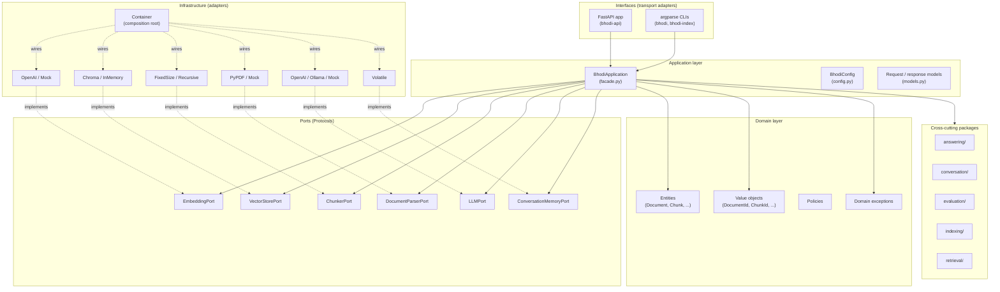

# Bhodi Architecture Overview

## High-level design

Bhodi is a RAG (Retrieval-Augmented Generation) framework built around **hexagonal architecture** (ports and adapters) with strict **dependency inversion**.

The central rule: domain logic never imports infrastructure. Instead, infrastructure implements domain-defined protocols. The `Container` is the only place where concrete adapter types are referenced.



---

## Directory structure

The real layout of `src/bhodi_platform/`:

```
src/bhodi_platform/
├── domain/                     # Pure business logic (no I/O, no infra imports)
│   ├── entities.py             # Document, Chunk, RetrievedDocument, ...
│   ├── value_objects.py        # DocumentId, ChunkId, ConversationId, ...
│   ├── policies.py
│   ├── services.py
│   └── exceptions.py
│
├── application/                # Use cases and orchestration
│   ├── config.py               # BhodiConfig + per-component Pydantic configs
│   ├── facade.py               # BhodiApplication (main entry point)
│   └── models.py               # IndexDocumentRequest/Response, QueryRequest/Response, HealthStatus, ...
│
├── ports/                      # Abstract dependencies (typing.Protocol)
│   ├── embedding.py
│   ├── vector_store.py
│   ├── chunker.py
│   ├── document_parser.py
│   ├── llm.py
│   ├── conversation_memory.py
│   ├── answering.py
│   └── indexing.py
│
├── infrastructure/             # Concrete adapters + composition root
│   ├── container.py            # Container (DI wiring; the only place that knows concrete types)
│   ├── embedding/              # openai.py, mock.py
│   ├── vector_store/           # chroma.py, in_memory.py
│   ├── chunker/                # fixed_size.py, recursive.py
│   ├── document_parser/        # pypdf.py, mock.py
│   ├── llm/                    # openai.py, ollama.py, mock.py
│   └── conversation_memory/    # volatile.py
│
├── interfaces/                 # Transport adapters
│   ├── api/                    # FastAPI app, server, routes (health, indexing, query)
│   └── cli/                    # argparse commands (main, indexing, query)
│
├── answering/                  # Generation engine and collaborators
├── conversation/               # Conversation infrastructure and runtime
├── evaluation/                 # Fixtures, runner, scoring, thresholds
├── indexing/                   # Higher-level indexing pipeline helpers
└── retrieval/                  # Retrieval runtime and settings
```

Two transitional surfaces still live in the tree:

- `src/bhodi_doc_analyzer/` — package root and `bhodi_doc_analyzer.config` are intentionally supported; other symbols are being retired.
- `src/indexer/` — legacy indexing shims that delegate into `bhodi_platform.indexing`.

New work belongs in `src/bhodi_platform/`.

---

## Core concepts

### Domain layer

Pure business logic. Zero imports from other `bhodi_platform` layers, zero external runtime dependencies (no `langchain`, no `chromadb`, no `httpx`).

- **Entities** — `Document`, `Chunk`, `RetrievedDocument`, `ConversationTurn`, ...
- **Value objects** — `DocumentId`, `ChunkId`, `ConversationId`, `Citation`, `EmbeddingVector`, ...
- **Policies / services** — domain rules that do not naturally live on a single entity.
- **Exceptions** — domain-specific errors that the interfaces layer maps to HTTP status codes.

### Ports (interfaces)

Ports define **what** the application needs from the outside world, not **how** it is implemented. Each port is a `typing.Protocol`:

```python
from typing import Protocol

class EmbeddingPort(Protocol):
    async def embed_documents(self, texts: list[str]) -> list[list[float]]: ...
    async def embed_query(self, text: str) -> list[float]: ...
```

`Protocol` gives structural typing: any class that implements the methods satisfies the contract — no inheritance coupling, and mock adapters in tests fit naturally.

### Adapters (infrastructure)

Adapters implement the ports against concrete technology. Each adapter lives in its own module under `infrastructure/<component>/` and accepts a typed config object in its constructor.

```python
class OpenAIEmbeddingsAdapter:
    def __init__(self, config: EmbeddingConfig) -> None:
        self._config = config
        self._client = None  # Lazy: created on first use, never at import time

    async def embed_documents(self, texts: list[str]) -> list[list[float]]:
        ...
```

Lazy initialization keeps health checks fast and avoids import-time side effects (no model downloads, no network calls, no vector-store creation).

### Container (composition root)

`bhodi_platform.infrastructure.container.Container` is the only place that knows about concrete adapter types. It maps a `BhodiConfig` to a fully-wired `BhodiApplication`:

```python
from bhodi_platform.application.config import BhodiConfig
from bhodi_platform.infrastructure.container import Container

config = BhodiConfig(
    embedding={"provider": "openai", "model": "text-embedding-3-small"},
    vector_store={"provider": "chroma", "persist_directory": "./data/chroma"},
    llm={"provider": "openai", "model": "gpt-4o-mini"},
)

app = Container(config).build()  # BhodiApplication with all adapters wired
```

The container caches adapter instances per process, builds the facade once, and never triggers adapter initialization on import.

---

## Data flow

### Indexing pipeline

```
IndexDocumentRequest (source, metadata, chunk_size, overlap)
        │
        ▼
DocumentParserPort.parse(source)                ── PyPDF / Mock
        │
        ▼
Document (text + metadata) + DocumentId
        │
        ▼
ChunkerPort.chunk(text, chunk_size, overlap)     ── FixedSize / Recursive
        │
        ▼
List[Chunk]  (chunks rebound to a new document_id space)
        │
        ▼
EmbeddingPort.embed_documents([chunk.content])  ── OpenAI / Mock
        │
        ▼
List[Tuple[Chunk, EmbeddingVector]]
        │
        ▼
VectorStorePort.add(chunks, embeddings)          ── Chroma / InMemory
        │
        ▼
IndexDocumentResponse(document_id, chunk_count)
```

### Query pipeline

```
QueryRequest (question, conversation_id?, top_k, temperature)
        │
        ▼
EmbeddingPort.embed_query(question)             ── OpenAI / Mock
        │
        ▼
VectorStorePort.search(embedding, top_k)         ── Chroma / InMemory
        │
        ▼
List[RetrievedDocument]  (ranked)
        │
        ▼
LLMPort.generate_with_context(question, retrieved, temperature)
        │                                       ── OpenAI / Ollama / Mock
        ▼
QueryResponse(answer_text, citations[], conversation_id)
```

---

## Configuration

`BhodiConfig` is the single source of truth for runtime behavior. It is built from typed Pydantic sub-configs (one per port), each of which exposes a `provider` string and an `extra: dict` for provider-specific keys.

```python
class BhodiConfig(BaseModel):
    parser: DocumentParserConfig       # default: provider="pypdf"
    chunker: ChunkerConfig             # default: provider="recursive"
    embedding: EmbeddingConfig         # default: provider="openai"
    vector_store: VectorStoreConfig    # default: provider="chroma"
    llm: LLMConfig                     # default: provider="openai"
    conversation: ConversationConfig   # default: provider="volatile"
    telemetry: TelemetryConfig         # default: enabled=True, exporter="console"
```

`BHODI_PARSER_PROVIDER`, `BHODI_CHUNKER_PROVIDER`, `BHODI_EMBEDDING_PROVIDER`, `BHODI_VECTOR_STORE_PROVIDER`, `BHODI_LLM_PROVIDER`, and `BHODI_CONVERSATION_PROVIDER` override the default `provider` for the matching sub-config. API-server-specific variables (`BHODI_API_HOST`, `BHODI_API_PORT`, `BHODI_API_SOURCE_ROOT`) are consumed by the `interfaces/api` layer, not by `BhodiConfig`.

Provider-specific options go in `extra`:

```python
LLMConfig(provider="ollama", model="llama3.2",
          extra={"base_url": "http://localhost:11434"})
```

---

## Key design decisions

### Protocol-based ports

Using `typing.Protocol` instead of `abc.ABC`:

- **Structural typing** — any class with the right methods satisfies the port; no inheritance coupling.
- **Trivial mocking** — tests can implement protocols with small fakes.
- **No import-time side effects** — there is no metaclass-driven registration.

### Async-first

All port methods are `async`. Adapters that wrap synchronous libraries (for example, `chromadb` and `pypdf`) are expected to use `asyncio.to_thread()` or equivalent so the event loop is never blocked.

### Lazy initialization

Adapters build their underlying clients on first use, not at import or container construction. The trade-off is intentional:

- Health checks stay under 50 ms.
- The `Container` does not allocate GPU or open network connections.
- Process startup cost is bounded by the application shell, not the adapter set.

### No hardcoded values

There are no model names, temperatures, chunk sizes, paths, or URLs in source. Every value lives in a Pydantic config model and is overridable via constructor argument or environment variable. `BhodiConfig` uses `model_config = ConfigDict(extra="ignore")` so partial overrides do not fail.

### Citation format

Citations are returned per retrieved chunk and always preserve source identity:

```python
class CitationResponse(BaseModel):
    chunk_id: str
    text: str            # truncated source text
    source_document: str # filename if known, else the document id
    page: int | None     # page number if the parser reported one
```

This format is stable across adapters; alternative shapes are introduced by adding fields, not by changing existing ones.

### Cross-cutting packages

`answering/`, `conversation/`, `evaluation/`, `indexing/`, and `retrieval/` are first-party packages that build on top of the core `domain → application → ports → infrastructure` stack. They are part of the shipped product surface, not optional plugins.

---

## Testing strategy

- **Unit tests** — domain logic and pure utilities, no mocks required.
- **Contract tests** — verify that each adapter satisfies its port's `Protocol`; mocking at the port boundary.
- **Integration tests** — real adapters against local services (e.g. embedded Chroma or `in_memory` stores); no external API calls.
- **End-to-end tests** — full pipeline with mock adapters so the suite runs offline.

---

## Telemetry

`BhodiConfig.telemetry` controls OpenTelemetry behavior. The default exporter is `console`; install `bhodi[telemetry]` and set `exporter="otlp"` with `otlp_endpoint` to ship traces to a collector. The application layer adds spans for the major pipeline stages (`indexing.parse`, `indexing.chunk`, `indexing.embed`, `indexing.store`, `query.embed`, `query.search`, `query.generate`) with attributes for `provider`, `model`, and `document_id` / `query_id` where available.

---

## Extensibility

Adding a new adapter for an existing port:

1. Create `src/bhodi_platform/infrastructure/<component>/<provider>.py` and implement the matching `Protocol`.
2. Accept a typed config object in the constructor; read provider-specific options from `extra`.
3. Register the provider in `Container._create_<component>_adapter()`.
4. Add a mock and a contract test.

Adding a brand-new port:

1. Define the `Protocol` under `src/bhodi_platform/ports/`.
2. Add a sub-config to `BhodiConfig`.
3. Add a field on `BhodiApplication` and a corresponding adapter directory.
4. Wire it through `Container.build()`.

Neither the domain layer nor the existing interfaces need to change.
